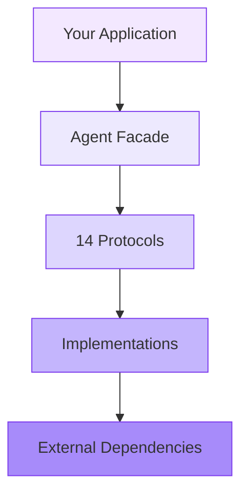

# Architecture

## Principles

Cognitia is built on Clean Architecture and SOLID:

- **Protocol-driven**: all contracts are `typing.Protocol` with `@runtime_checkable`. No abstract classes.
- **ISP**: each Protocol contains no more than 5 methods.
- **DIP**: consumers depend on Protocols, not on concrete implementations.
- **Immutable types**: all domain objects are frozen dataclasses. Mutation through creating a new instance.
- **No domain leak**: the library knows nothing about the business application. Grep `freedom_agent` across `src/` — 0 matches.

## Layers

```text
┌─────────────────────────────────────────────────┐
│  Business Application (your_app)                │
│  Knows about cognitia. Implements concrete      │
│  business providers, prompts, roles.            │
├─────────────────────────────────────────────────┤
│  cognitia (library)                             │
│  ┌────────────┐ ┌──────────┐ ┌───────────────┐  │
│  │  bootstrap  │ │ context  │ │   runtime     │  │
│  │  (stack)    │ │ (builder)│ │ (claude/thin/ │  │
│  │             │ │          │ │  deepagents)  │  │
│  ├────────────┤ ├──────────┤ ├───────────────┤  │
│  │  policy    │ │ session  │ │   tools       │  │
│  │ (deny/allow│ │ (manager,│ │ (sandbox,     │  │
│  │  selector) │ │  rehydr.)│ │  builtin,web) │  │
│  ├────────────┤ ├──────────┤ ├───────────────┤  │
│  │  memory    │ │  skills  │ │   todo        │  │
│  │ (inmemory, │ │ (registry│ │ (inmemory,    │  │
│  │  postgres) │ │  loader) │ │  fs, db)      │  │
│  ├────────────┤ ├──────────┤ ├───────────────┤  │
│  │ memory_bank│ │  routing │ │ orchestration │  │
│  │ (fs, db)   │ │ (keyword)│ │ (plan, sub,   │  │
│  │            │ │          │ │  team, msg)   │  │
│  └────────────┘ └──────────┘ └───────────────┘  │
├─────────────────────────────────────────────────┤
│  External Dependencies (LLM API, DB, MCP)       │
└─────────────────────────────────────────────────┘
```

## Packages

| Package | Purpose | Dependencies |
| ------- | ------- | ------------ |
| `bootstrap` | Facade: `CognitiaStack.create()`, capabilities wiring | core |
| `context` | System prompt assembly with token budget | core |
| `session` | SessionManager, Rehydrator (history management) | memory |
| `memory` | Message, fact, goal storage (InMemory, Postgres, SQLite) | core |
| `memory_bank` | Long-term file-based memory (FS, DB) | core |
| `todo` | Checklists / task tracking (InMemory, FS, DB) | core |
| `tools` | Sandbox isolation, builtin tools, web, thinking | core |
| `orchestration` | Planning, subagents, team mode, message bus | core |
| `policy` | ToolPolicy (deny/allow), ToolSelector (budget) | core |
| `routing` | KeywordRoleRouter (auto role-switching) | core |
| `skills` | SkillRegistry, YamlSkillLoader (MCP skills) | core |
| `runtime` | AgentRuntime (Claude SDK, ThinRuntime, DeepAgents) | extras |
| `resilience` | Circuit breaker for external calls | core |
| `observability` | Structured JSON logging | structlog |
| `hooks` | Lifecycle hooks (pre/post turn) | core |
| `commands` | CommandRegistry (slash-commands) | core |

## Protocol Map

```text
MessageStore ─────┐
FactStore ────────┤
GoalStore ────────┤── memory providers (InMemory, Postgres, SQLite)
SummaryStore ─────┤
SessionStateStore ┘

MemoryBankProvider ── memory_bank providers (FS, DB)

TodoProvider ──────── todo providers (InMemory, FS, DB)

SandboxProvider ───── sandbox providers (Local, E2B, Docker)

WebProvider ────────── web providers (Httpx)

AgentRuntime ──────── runtime (ClaudeCode, Thin, DeepAgents)

PlanStore ─────────── plan stores (InMemory)
PlannerMode ───────── planners (Thin, DeepAgents)

SubagentOrchestrator ── subagent orchestrators (Thin, DeepAgents, Claude)
TeamOrchestrator ────── team orchestrators (DeepAgents, Claude)
```

## Dependency Direction



Dependencies always point **inward** (Infrastructure → Application → Domain). The domain layer has zero external dependencies. Your application code depends only on Protocols — never on concrete implementations.

## Design Decisions

### Why Protocols over ABC?

- `typing.Protocol` supports structural subtyping — no inheritance required
- Implementations don't need to explicitly inherit from the protocol
- Enables duck typing with static type checking
- `@runtime_checkable` for runtime validation where needed

### Why Frozen Dataclasses?

- Immutability prevents accidental state mutation
- Thread-safe by design
- Hashable — can be used in sets and as dict keys
- Forces explicit state transitions through new instance creation

### Why ≤5 Methods per Protocol (ISP)?

- Small interfaces are easier to implement and test
- Reduces coupling between components
- Each protocol represents a single responsibility
- Mix-and-match: implement only the protocols you need
